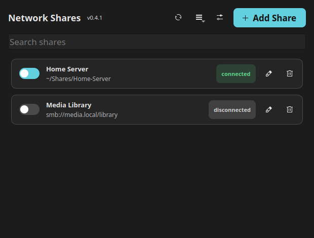

# Mountie

Mount and manage network shares and read-only ISO images from a small desktop app. Mountie supports
SMB/CIFS, AFP, NFS, SFTP, and WebDAV through GVfs without requiring root. An
optional native SMB/CIFS backend is available through a narrowly scoped,
administrator-installed helper.



## Features

- Add, edit, discover, import, and remove network shares
- Mount ISO images as read-only data sources, like removable media
- Connect or disconnect one share—or all shares—with a click
- Find mounted shares at `~/Shares/<label>` by default
- Ask for passwords each time, keep them until logout, or save them in your
  system keyring
- Reuse credential profiles across shares
- Disconnect after a set time, on screen lock, or before suspend
- Follow your desktop theme and accent color, with light and dark overrides
- Optionally mount SMB/CIFS shares with the native kernel driver instead of
  GVfs, for better throughput on large transfers (opt-in, one-time setup)

## Requirements

- Python 3.9+
- PyQt5 and PyGObject (`Gio` and `Secret` typelibs)
- GVfs and the backends for the protocols you use
- UDisks2 (`udisksctl`) for mounting ISO images
- A Secret Service provider such as GNOME Keyring or KWallet

On Debian/Ubuntu-based systems, network backends are provided by the
`gvfs-backends` package.

## Install

```sh
./install.sh
```

This installs Mountie in `~/.local/share/mountie` and adds it to your app
launcher. To install it as a Python package instead:

```sh
pip install .
```

Then launch it with `mountie`.

## Use

1. Open Mountie and select **Add → Network Share** or **Add → ISO Image**.
2. Enter the server details, choose a template, or use **Discover** to browse
   shares advertised on your network.
3. Choose how credentials should be handled and save the share.
4. Use its toggle to connect or disconnect.

GVfs mounts are linked into `~/Shares` for convenient access. Native mounts
appear there directly. The link directory and link creation can be changed in
`~/.config/mountie/config.json`.

New installations default to **Ask every time**, so passwords are not stored.
Other policies keep passwords in the desktop keyring—never in Mountie's
configuration or logs. Configuration exports do not include passwords.

The actions menu contains Connect All, Disconnect All, credential profiles,
and configuration import/export. Settings contains appearance, credential,
and diagnostic options.

## Native mount (optional)

Add Share's Connection tab has a **Mount using** option for SMB/CIFS shares:
GVfs (the default) or a native kernel `mount.cifs`. Native mount can be
noticeably faster for large transfers, but it needs root, so it's opt-in and
requires a one-time setup step.

**Settings → General → Native mount** shows whether it's set up on this
machine, and if not, a **Show setup command…** button that gives you a
ready-to-copy `sudo bash -- <path>` command — this works the same way whether
Mountie is installed natively or as a Flatpak, no need to go find anything
in the repo yourself. Equivalently, from a git checkout:

```sh
sudo scripts/install-native-mount-helper.sh
```

Either way, this installs a small privileged helper and a polkit policy that
authorizes it; connecting a native-mount share then shows a normal system
authentication prompt. See
[docs/native-mount-backend.md](docs/native-mount-backend.md) for exactly what
it grants and why. Existing GVfs shares are unaffected either way.

To remove the native helper and its authorization policy, return to
**Settings → General → Native mount** and select **Show removal command…**.
From a git checkout, the equivalent command is:

```sh
sudo scripts/install-native-mount-helper.sh --uninstall
```

Unmount native shares before removing the helper. GVfs support continues to
work after removal.

## Notes

- Network discovery depends on the GVfs backends installed on your system.
- Auto-disconnect and lock/suspend handling require Mountie to remain running.
- Duration-based auto-disconnect measures total connection time, not idle time.
- Settings are stored at `~/.config/mountie/config.json` for native installs.
  Flatpak stores them in its application-data directory.
- Native-mount shares don't participate in GVfs's live mount-change
  notifications, so their status only refreshes on startup, on manual
  refresh, or right after Mountie mounts/unmounts them itself.

## Development

Run the test suite with:

```sh
python3 -m unittest discover -s tests -v
```

See [the cloud integration design](docs/cloud-integrations.md) for future
provider work.

## License

See [LICENSE](LICENSE).
